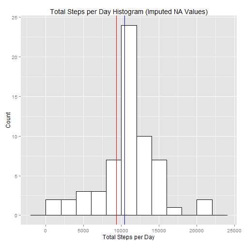

# Reproducible Research: Peer Assessment 1
## Student: Roberto Gonzalo Rodriguez
## e-mail: gonzarodri@gmail.com


## Loading and preprocessing the data

At this step, data is loaded from the activity.csv in the .zip file. The `data` data frame will include the following fields:

- steps: (int) Number of steps in a 5-minute interval
- date: (Date) The date on which the measurement was taken
- interval: (int) Identifier for th e5-minute interval in which measurement was taken


```r
# Load libraries
library(dplyr)
library(ggplot2)

# Load data
data <- read.csv(unz("activity.zip","activity.csv"), colClasses=c("integer","Date","integer"))
```

## What is mean total number of steps taken per day?

This question is answered summarizing the total steps by day and showing a histogram with the result.


```r
# Summarizes the steps by day (ignore null values)
steps_per_day <- data %>% group_by(date) %>% summarize( total_steps = sum(steps, na.rm = TRUE))

# Calculate mean and median
steps_per_day_mean <- mean(steps_per_day$total_steps, na.rm = TRUE)
steps_per_day_median <- median(steps_per_day$total_steps, na.rm = TRUE)

# Output Values
steps_per_day_mean
```

```
## [1] 9354.23
```

```r
steps_per_day_median
```

```
## [1] 10395
```

```r
# Plot Histogram
ggplot(steps_per_day, aes(x = total_steps)) + 
    geom_histogram(binwidth=2000,colour="black", fill="white") + 
    geom_vline(aes(xintercept=steps_per_day_mean), color="red") +
    geom_vline(aes(xintercept=steps_per_day_median), color="blue") +
    xlab("Total Steps per Day") +
    ylab("Count") +
    ggtitle("Total Steps per Day Histogram")
```

 

Total steps per day has a mean of **9354.2295082** (red line) and a median of **10395** steps (blue line).

## What is the average daily activity pattern?

The daily activity pattern is shown using a Line Plot plotting the average steps for each 5-minute interval.


```r
# Summarizes the average steps by interval accross all days
steps_per_interval <- 
    data %>% 
    group_by(interval) %>% 
    summarize( average_steps = mean(steps, na.rm = TRUE))

# Calculate interval of max average steps
interval_max <- steps_per_interval$interval[which.max(steps_per_interval$average_steps)]

# Output Value
interval_max
```

```
## [1] 835
```

```r
# Plot Time Series
ggplot(steps_per_interval, aes(x = interval,y = average_steps)) + 
    geom_line() + 
    geom_vline(aes(xintercept=interval_max), color="red") +
    xlab("5-minute Interval") +
    ylab("Average Steps") +
    ggtitle("Daily Activity Pattern")
```

 

As shown above, the interval which has more activity in average is **835** 

## Imputing missing values


```r
# Calculate the number of null values
na_values <- nrow(data[which(is.na(data$steps)),])

# Ouput Value
na_values
```

```
## [1] 2304
```

As shown above, there are **2304** missing values in the dataset. As a strategy to imputing these missing values, we use the average step for the corresponding 5-minute interval accross all days of the dataset.


```r
# Data Frame data_i does not contains NA steps
data_i <- with( 
        merge(x = data, y = steps_per_interval, by = "interval"), 
            data.frame(
                interval, 
                date, 
                steps = as.integer(ifelse(is.na(steps), average_steps, steps))
                )
        )

# Summarizes the steps by day (ignore null values)
steps_per_day_i <- data_i %>% group_by(date) %>% summarize( total_steps = sum(steps, na.rm = TRUE))

# Calculate mean and median
steps_per_day_mean_i <- mean(steps_per_day_i$total_steps, na.rm = TRUE)
steps_per_day_median_i <- median(steps_per_day_i$total_steps, na.rm = TRUE)

# Output Values
steps_per_day_mean_i
```

```
## [1] 10749.77
```

```r
steps_per_day_median_i
```

```
## [1] 10641
```

```r
# Plot Histogram
ggplot(steps_per_day_i, aes(x = total_steps)) + 
    geom_histogram(binwidth=2000,colour="black", fill="white") + 
    geom_vline(aes(xintercept=steps_per_day_mean), color="red") +
    geom_vline(aes(xintercept=steps_per_day_median), color="blue") +
    xlab("Total Steps per Day") +
    ylab("Count") +
    ggtitle("Total Steps per Day Histogram (Imputed NA Values)")
```

 

The new calculated mean **1.074977 &times; 10<sup>4</sup>** and median **10641** slightly differ from the calculated in the first step. However, imputing missing data shows a remarkable impact on the histogram.

## Are there differences in activity patterns between weekdays and weekends?

To answer this question, we are going to plot below two panel to compare the difference in the activity patterns from weekends and weekdays


```r
# Create a new factor column indicating whether it is a weekday or weekend day.
data_wd <- mutate(data_i, 
      day_of_week = factor(ifelse(as.POSIXlt(data_i$date)$wday %in% 1:5, "Weekday","Weekend")))

# Summarizes the average steps by interval accross all days
steps_per_interval_wd <- 
    data_wd %>% 
    group_by(interval, day_of_week) %>% 
    summarize( average_steps = mean(steps, na.rm = TRUE))

# Plot Time Series
ggplot(steps_per_interval_wd, aes(x = interval,y = average_steps, color = day_of_week)) + 
    geom_line() + 
    facet_grid(day_of_week~.) +
    xlab("5-minute Interval") +
    ylab("Average Steps") +
    ggtitle("Daily Activity Pattern Weekdays vs Weekend")
```

 

